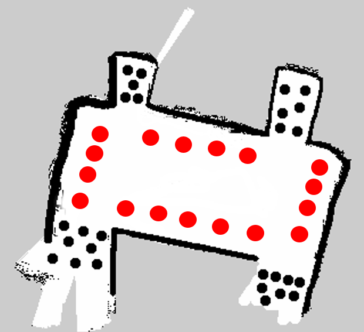
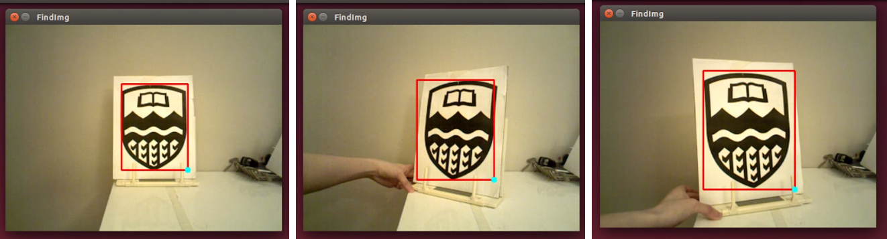
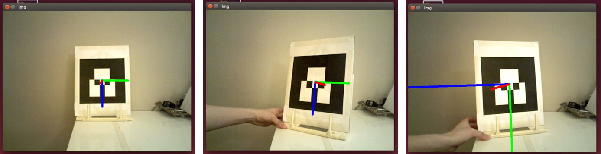

# Project : Egg-hunting-Robot_ROS
The project is done at University of Alberta (UoA) for the course CMPUT 412: Experimental Robotics.

## Overview
The robot builds a map of the environment, moves along the map from a randomly placed location, finds the visual targets placed on the walls, and docks infront of the target while playing a unique sound to the target type.  

## Dependencies
We tested our project on the following environment.
* Ubuntu 14.04
* Python 2.7.6
* ROS Indigo
* Numpy
* OpenCV-Python 2.4.8
 

How to configure Joy:
http://wiki.ros.org/joy/Tutorials/ConfiguringALinuxJoystick

## How to run 
### Collect map 
See previous Project: SLAM-Robot Using ROS-Kobuki Turtlebot for a complete description on how to perform GMapping for map collection.
In addition, the costmap was modified to prevent the robot from moving outside of the map (i.e.: down the hallway or the washroom areas) when localization fails. 

### Localization
Unlike the previous project where the robot's initial position could be manually set via the 2D pose estimate in RVIZ, this project requires the robot to search for its initial position. Luckily, the AMCL package includes a global localization rosservice call. This facilitates the dispersion of all particles randomly through the free space in the map, so that AMCL can search for the robot's location on the entire map. 

Then, two localization methods were tested. The first method involves the robot performing a gradual outward spiral motion and random walk to make particles converge. The second method involves the robot performing stationary spinning motion to make particles converge. The exit condition for both methods are based on a fix time constraint (time stamp). After several tests, it was found that the second method outperforms the first in terms of its accuracy and rate of success. Therefore, the second method is implemented. After the robot is localized, navigation starts. 

### Navigation
The same actionlib as the previous project is used. However, instead of 4 waypoints on the map, 17 waypoints are set and sent to the navigation stack. The reason for an increase in the number of waypoints is to cover the 5 walls in a symmetric manner using 1 RGB camera for vision. The symmetric manner means that if the robot localizes in the wrong half region of the map, it can still cover all walls correctly without missing any possible target locations (note: walls on opposite ends are non-symmetric, i.e.: one side has door the other doesnt). In addition, if 2 cameras are used instead of 1, where the other camera faces the side wall, then 6 waypoints should be sufficient. However, because of computer compatability issue, the laptop was unable to support a second camera feature. When using Kernel 3.13, a second camera can be supported with the laptop, but sound and internet was lost. 

Then, after the robot performs initial localization, it travels to the nearest waypoint and starts to loop through the remaining 16 waypoints, while searching for targets on the wall. 

  

### Target Detection
Two different methods will be used to detect the two different targets on the wall.
#### UA logo: Template Matching
The UA logo is detected via template matching at multiple scales to ensure that the target is never missed. Then the Canny edge detector is applied, where template matching is performed using edges rather than the raw image to increase the matching accuracy. When the maximum correlation value exceeds the threshold value, it will be deemed a good match. The result shows a good match at 0.7m from the camera. In summary, the 2 main tunable parameters here are the scale of the image, and the threshold value. 

   

#### AR logo: AR_track_alvar
The AR logo is detected via the ar_track_alvar ROS package. Initially, AR logo detection with template matching was tried, but was unsuccessful as the match was unstable. 

   

#### Face-wall at 90 degrees
It is important for the robot to face the wall at 90 degrees at each waypoint for the robot to properly detect the target on the wall. Although the waypoints are set with a robot pose that faces the wall, any inaccuracy in the initial localzation step will offset the robot's pose when it arrives to each waypoint. Therefore, a rotate and laser scan motion are combined to find and turn towards the wall. 

In turtlebot_gazebo, a simulation of the robot's rotate and laser scan motion is performed and several different methods were tested. The result shows that 13 turns with an angular velocity unit of 1.0 and rospy.Rate(0.5) completes a full rotation in synchronization with the laser scan. However, when tested on the actual kobuki, 19 turns were required to complete a full rotation. Then when combining the facewall function with the rest of the code, 25 turns were required to complete a full rotation. The difference in number of turns may be attributed by the differences in odometry. 

  

### Docking
The docking path is calculated based on the robot's pose. Two algorithms are used for two different visual targets, one for the AR Tag and the other for the UA Emblem. For the AR Tag, the ar_track_alvar package from ROS and cv2.projectPoints are used for pose detection. For the UA Emblem, the corner of the drawn match template is used for pose detection. An errx variable is calculated based on the robot's pose as shown below. Based on the errx value, the robot will turn clockwise/anti-clockwise. For example, if the AR Tag is detected, and a errx<-80, the robot will turn 90 degrees anti-clockwise, move slightly forward, then turn 90 degrees clockwise to continue to facewall and read in a new value of errx. The mapping of errx values and its corresponding moving distances for both targets have been done and implemented. After docking, the robot undocks by travelling back to its waypoint position. 

In turtlebot_gazebo, a simulation of the robot's docking motion using the AR Tag is performed. 

  

  

### Trial after the competition

### Discussion
It is observed that localization is the most critical step. The localization method implemented here has a success rate of ~50%. Slight localization failures can be corrected with the facewall function. It is also observed that the odometry of kobuki in turtlebot_gazebo simulation and real robot behaves slightly different. Nevertheless, simulation helps to verify the feasibility of algorithms.  

### Future Work
Improve the localization method to increase the success rate.

## Authors

* [Nazmus Sakib](https://github.com/nsa31)
* [Vivian Ting](https://github.com/jtuoa)
## Acknowledgement 

* [Programming Robots with ROS](https://github.com/osrf/rosbook/blob/master)

